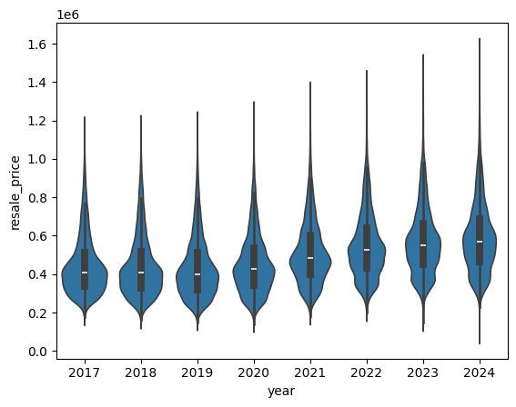
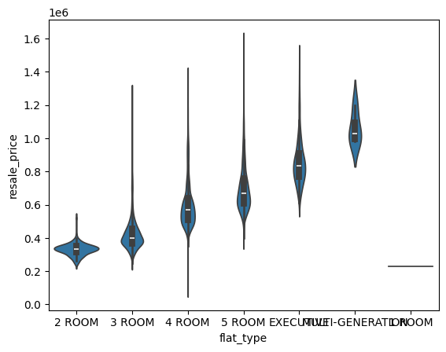

# HDB Data Analysis
https://beta.data.gov.sg/datasets/d_8b84c4ee58e3cfc0ece0d773c8ca6abc/view


```python
import pandas as pd
import seaborn as sns

df = pd.read_csv("data/ResaleflatpricesbasedonregistrationdatefromJan2017onwards.csv")
df.head()
```


<div>
<style scoped>
    .dataframe tbody tr th:only-of-type {
        vertical-align: middle;
    }

    .dataframe tbody tr th {
        vertical-align: top;
    }

    .dataframe thead th {
        text-align: right;
    }
</style>
<table border="1" class="dataframe">
  <thead>
    <tr style="text-align: right;">
      <th></th>
      <th>month</th>
      <th>town</th>
      <th>flat_type</th>
      <th>block</th>
      <th>street_name</th>
      <th>storey_range</th>
      <th>floor_area_sqm</th>
      <th>flat_model</th>
      <th>lease_commence_date</th>
      <th>remaining_lease</th>
      <th>resale_price</th>
    </tr>
  </thead>
  <tbody>
    <tr>
      <th>0</th>
      <td>2017-01</td>
      <td>ANG MO KIO</td>
      <td>2 ROOM</td>
      <td>406</td>
      <td>ANG MO KIO AVE 10</td>
      <td>10 TO 12</td>
      <td>44.0</td>
      <td>Improved</td>
      <td>1979</td>
      <td>61 years 04 months</td>
      <td>232000.0</td>
    </tr>
    <tr>
      <th>1</th>
      <td>2017-01</td>
      <td>ANG MO KIO</td>
      <td>3 ROOM</td>
      <td>108</td>
      <td>ANG MO KIO AVE 4</td>
      <td>01 TO 03</td>
      <td>67.0</td>
      <td>New Generation</td>
      <td>1978</td>
      <td>60 years 07 months</td>
      <td>250000.0</td>
    </tr>
    <tr>
      <th>2</th>
      <td>2017-01</td>
      <td>ANG MO KIO</td>
      <td>3 ROOM</td>
      <td>602</td>
      <td>ANG MO KIO AVE 5</td>
      <td>01 TO 03</td>
      <td>67.0</td>
      <td>New Generation</td>
      <td>1980</td>
      <td>62 years 05 months</td>
      <td>262000.0</td>
    </tr>
    <tr>
      <th>3</th>
      <td>2017-01</td>
      <td>ANG MO KIO</td>
      <td>3 ROOM</td>
      <td>465</td>
      <td>ANG MO KIO AVE 10</td>
      <td>04 TO 06</td>
      <td>68.0</td>
      <td>New Generation</td>
      <td>1980</td>
      <td>62 years 01 month</td>
      <td>265000.0</td>
    </tr>
    <tr>
      <th>4</th>
      <td>2017-01</td>
      <td>ANG MO KIO</td>
      <td>3 ROOM</td>
      <td>601</td>
      <td>ANG MO KIO AVE 5</td>
      <td>01 TO 03</td>
      <td>67.0</td>
      <td>New Generation</td>
      <td>1980</td>
      <td>62 years 05 months</td>
      <td>265000.0</td>
    </tr>
  </tbody>
</table>
</div>


```python
df["year"] = df.month.apply(lambda val: val.split("-")[0])
df.head()
```


<div>
<style scoped>
    .dataframe tbody tr th:only-of-type {
        vertical-align: middle;
    }

    .dataframe tbody tr th {
        vertical-align: top;
    }

    .dataframe thead th {
        text-align: right;
    }
</style>
<table border="1" class="dataframe">
  <thead>
    <tr style="text-align: right;">
      <th></th>
      <th>month</th>
      <th>town</th>
      <th>flat_type</th>
      <th>block</th>
      <th>street_name</th>
      <th>storey_range</th>
      <th>floor_area_sqm</th>
      <th>flat_model</th>
      <th>lease_commence_date</th>
      <th>remaining_lease</th>
      <th>resale_price</th>
      <th>year</th>
    </tr>
  </thead>
  <tbody>
    <tr>
      <th>0</th>
      <td>2017-01</td>
      <td>ANG MO KIO</td>
      <td>2 ROOM</td>
      <td>406</td>
      <td>ANG MO KIO AVE 10</td>
      <td>10 TO 12</td>
      <td>44.0</td>
      <td>Improved</td>
      <td>1979</td>
      <td>61 years 04 months</td>
      <td>232000.0</td>
      <td>2017</td>
    </tr>
    <tr>
      <th>1</th>
      <td>2017-01</td>
      <td>ANG MO KIO</td>
      <td>3 ROOM</td>
      <td>108</td>
      <td>ANG MO KIO AVE 4</td>
      <td>01 TO 03</td>
      <td>67.0</td>
      <td>New Generation</td>
      <td>1978</td>
      <td>60 years 07 months</td>
      <td>250000.0</td>
      <td>2017</td>
    </tr>
    <tr>
      <th>2</th>
      <td>2017-01</td>
      <td>ANG MO KIO</td>
      <td>3 ROOM</td>
      <td>602</td>
      <td>ANG MO KIO AVE 5</td>
      <td>01 TO 03</td>
      <td>67.0</td>
      <td>New Generation</td>
      <td>1980</td>
      <td>62 years 05 months</td>
      <td>262000.0</td>
      <td>2017</td>
    </tr>
    <tr>
      <th>3</th>
      <td>2017-01</td>
      <td>ANG MO KIO</td>
      <td>3 ROOM</td>
      <td>465</td>
      <td>ANG MO KIO AVE 10</td>
      <td>04 TO 06</td>
      <td>68.0</td>
      <td>New Generation</td>
      <td>1980</td>
      <td>62 years 01 month</td>
      <td>265000.0</td>
      <td>2017</td>
    </tr>
    <tr>
      <th>4</th>
      <td>2017-01</td>
      <td>ANG MO KIO</td>
      <td>3 ROOM</td>
      <td>601</td>
      <td>ANG MO KIO AVE 5</td>
      <td>01 TO 03</td>
      <td>67.0</td>
      <td>New Generation</td>
      <td>1980</td>
      <td>62 years 05 months</td>
      <td>265000.0</td>
      <td>2017</td>
    </tr>
  </tbody>
</table>
</div>


```python
sns.violinplot(df, x="year", y="resale_price")
```


    <Axes: xlabel='year', ylabel='resale_price'>


    

    


```python
df.head()
```


<div>
<style scoped>
    .dataframe tbody tr th:only-of-type {
        vertical-align: middle;
    }

    .dataframe tbody tr th {
        vertical-align: top;
    }

    .dataframe thead th {
        text-align: right;
    }
</style>
<table border="1" class="dataframe">
  <thead>
    <tr style="text-align: right;">
      <th></th>
      <th>month</th>
      <th>town</th>
      <th>flat_type</th>
      <th>block</th>
      <th>street_name</th>
      <th>storey_range</th>
      <th>floor_area_sqm</th>
      <th>flat_model</th>
      <th>lease_commence_date</th>
      <th>remaining_lease</th>
      <th>resale_price</th>
      <th>year</th>
    </tr>
  </thead>
  <tbody>
    <tr>
      <th>0</th>
      <td>2017-01</td>
      <td>ANG MO KIO</td>
      <td>2 ROOM</td>
      <td>406</td>
      <td>ANG MO KIO AVE 10</td>
      <td>10 TO 12</td>
      <td>44.0</td>
      <td>Improved</td>
      <td>1979</td>
      <td>61 years 04 months</td>
      <td>232000.0</td>
      <td>2017</td>
    </tr>
    <tr>
      <th>1</th>
      <td>2017-01</td>
      <td>ANG MO KIO</td>
      <td>3 ROOM</td>
      <td>108</td>
      <td>ANG MO KIO AVE 4</td>
      <td>01 TO 03</td>
      <td>67.0</td>
      <td>New Generation</td>
      <td>1978</td>
      <td>60 years 07 months</td>
      <td>250000.0</td>
      <td>2017</td>
    </tr>
    <tr>
      <th>2</th>
      <td>2017-01</td>
      <td>ANG MO KIO</td>
      <td>3 ROOM</td>
      <td>602</td>
      <td>ANG MO KIO AVE 5</td>
      <td>01 TO 03</td>
      <td>67.0</td>
      <td>New Generation</td>
      <td>1980</td>
      <td>62 years 05 months</td>
      <td>262000.0</td>
      <td>2017</td>
    </tr>
    <tr>
      <th>3</th>
      <td>2017-01</td>
      <td>ANG MO KIO</td>
      <td>3 ROOM</td>
      <td>465</td>
      <td>ANG MO KIO AVE 10</td>
      <td>04 TO 06</td>
      <td>68.0</td>
      <td>New Generation</td>
      <td>1980</td>
      <td>62 years 01 month</td>
      <td>265000.0</td>
      <td>2017</td>
    </tr>
    <tr>
      <th>4</th>
      <td>2017-01</td>
      <td>ANG MO KIO</td>
      <td>3 ROOM</td>
      <td>601</td>
      <td>ANG MO KIO AVE 5</td>
      <td>01 TO 03</td>
      <td>67.0</td>
      <td>New Generation</td>
      <td>1980</td>
      <td>62 years 05 months</td>
      <td>265000.0</td>
      <td>2017</td>
    </tr>
  </tbody>
</table>
</div>


```python
df.info()
```

    <class 'pandas.core.frame.DataFrame'>
    RangeIndex: 176737 entries, 0 to 176736
    Data columns (total 12 columns):
     #   Column               Non-Null Count   Dtype  
    ---  ------               --------------   -----  
     0   month                176737 non-null  object 
     1   town                 176737 non-null  object 
     2   flat_type            176737 non-null  object 
     3   block                176737 non-null  object 
     4   street_name          176737 non-null  object 
     5   storey_range         176737 non-null  object 
     6   floor_area_sqm       176737 non-null  float64
     7   flat_model           176737 non-null  object 
     8   lease_commence_date  176737 non-null  int64  
     9   remaining_lease      176737 non-null  object 
     10  resale_price         176737 non-null  float64
     11  year                 176737 non-null  int64  
    dtypes: float64(2), int64(2), object(8)
    memory usage: 16.2+ MB


```python
with pd.option_context("display.float_format", "{:,.2f}".format):
    print(df.groupby("year")["resale_price"].describe())
```

             count       mean        std        min        25%        50%  \
    year                                                                    
    2017 20,509.00 443,888.52 149,148.32 175,000.00 338,000.00 410,000.00   
    2018 21,561.00 441,282.06 157,569.22 160,000.00 328,000.00 408,000.00   
    2019 22,186.00 432,137.91 153,975.69 150,000.00 320,000.00 400,000.00   
    2020 23,333.00 452,279.38 154,500.42 140,000.00 340,000.00 425,000.00   
    2021 29,087.00 511,381.24 162,619.25 180,000.00 399,000.00 483,000.00   
    2022 26,720.00 549,714.33 170,278.25 200,000.00 430,000.00 525,000.00   
    2023 25,762.00 571,801.22 173,817.42 150,000.00 450,000.00 550,000.00   
    2024  7,579.00 590,560.33 181,138.02 100,000.00 465,000.00 570,000.00   
    
                75%          max  
    year                          
    2017 510,000.00 1,180,000.00  
    2018 515,888.00 1,185,000.00  
    2019 510,000.00 1,205,000.00  
    2020 534,000.00 1,258,000.00  
    2021 600,000.00 1,360,000.00  
    2022 640,000.00 1,418,000.00  
    2023 662,000.00 1,500,000.00  
    2024 688,000.00 1,568,888.00  


```python
sns.violinplot(df.query('year == "2024"'), x="flat_type", y="resale_price")
```


    <Axes: xlabel='flat_type', ylabel='resale_price'>


    

    


```python
resale_1mil = df.query('year == "2024" and resale_price > 1000000')
resale_1mil.info()
```

    <class 'pandas.core.frame.DataFrame'>
    Index: 186 entries, 169240 to 176735
    Data columns (total 12 columns):
     #   Column               Non-Null Count  Dtype  
    ---  ------               --------------  -----  
     0   month                186 non-null    object 
     1   town                 186 non-null    object 
     2   flat_type            186 non-null    object 
     3   block                186 non-null    object 
     4   street_name          186 non-null    object 
     5   storey_range         186 non-null    object 
     6   floor_area_sqm       186 non-null    float64
     7   flat_model           186 non-null    object 
     8   lease_commence_date  186 non-null    int64  
     9   remaining_lease      186 non-null    object 
     10  resale_price         186 non-null    float64
     11  year                 186 non-null    object 
    dtypes: float64(2), int64(1), object(9)
    memory usage: 18.9+ KB


```python
resale_1mil.groupby("flat_type").resale_price.describe()
```


<div>
<style scoped>
    .dataframe tbody tr th:only-of-type {
        vertical-align: middle;
    }

    .dataframe tbody tr th {
        vertical-align: top;
    }

    .dataframe thead th {
        text-align: right;
    }
</style>
<table border="1" class="dataframe">
  <thead>
    <tr style="text-align: right;">
      <th></th>
      <th>count</th>
      <th>mean</th>
      <th>std</th>
      <th>min</th>
      <th>25%</th>
      <th>50%</th>
      <th>75%</th>
      <th>max</th>
    </tr>
    <tr>
      <th>flat_type</th>
      <th></th>
      <th></th>
      <th></th>
      <th></th>
      <th></th>
      <th></th>
      <th></th>
      <th></th>
    </tr>
  </thead>
  <tbody>
    <tr>
      <th>3 ROOM</th>
      <td>1.0</td>
      <td>1.280000e+06</td>
      <td>NaN</td>
      <td>1280000.0</td>
      <td>1280000.0</td>
      <td>1280000.0</td>
      <td>1280000.0</td>
      <td>1280000.0</td>
    </tr>
    <tr>
      <th>4 ROOM</th>
      <td>52.0</td>
      <td>1.089150e+06</td>
      <td>79949.895664</td>
      <td>1000088.0</td>
      <td>1030000.0</td>
      <td>1059250.0</td>
      <td>1141000.0</td>
      <td>1370000.0</td>
    </tr>
    <tr>
      <th>5 ROOM</th>
      <td>77.0</td>
      <td>1.149777e+06</td>
      <td>135156.270987</td>
      <td>1000088.0</td>
      <td>1060000.0</td>
      <td>1100000.0</td>
      <td>1210000.0</td>
      <td>1568888.0</td>
    </tr>
    <tr>
      <th>EXECUTIVE</th>
      <td>54.0</td>
      <td>1.142957e+06</td>
      <td>116857.259914</td>
      <td>1000888.0</td>
      <td>1046250.0</td>
      <td>1105000.0</td>
      <td>1208000.0</td>
      <td>1480000.0</td>
    </tr>
    <tr>
      <th>MULTI-GENERATION</th>
      <td>2.0</td>
      <td>1.130000e+06</td>
      <td>98994.949366</td>
      <td>1060000.0</td>
      <td>1095000.0</td>
      <td>1130000.0</td>
      <td>1165000.0</td>
      <td>1200000.0</td>
    </tr>
  </tbody>
</table>
</div>


```python
resale_1mil[resale_1mil["flat_type"] == "3 ROOM"].T
```


<div>
<style scoped>
    .dataframe tbody tr th:only-of-type {
        vertical-align: middle;
    }

    .dataframe tbody tr th {
        vertical-align: top;
    }

    .dataframe thead th {
        text-align: right;
    }
</style>
<table border="1" class="dataframe">
  <thead>
    <tr style="text-align: right;">
      <th></th>
      <th>172813</th>
    </tr>
  </thead>
  <tbody>
    <tr>
      <th>month</th>
      <td>2024-02</td>
    </tr>
    <tr>
      <th>town</th>
      <td>KALLANG/WHAMPOA</td>
    </tr>
    <tr>
      <th>flat_type</th>
      <td>3 ROOM</td>
    </tr>
    <tr>
      <th>block</th>
      <td>58</td>
    </tr>
    <tr>
      <th>street_name</th>
      <td>JLN MA'MOR</td>
    </tr>
    <tr>
      <th>storey_range</th>
      <td>01 TO 03</td>
    </tr>
    <tr>
      <th>floor_area_sqm</th>
      <td>208.0</td>
    </tr>
    <tr>
      <th>flat_model</th>
      <td>Terrace</td>
    </tr>
    <tr>
      <th>lease_commence_date</th>
      <td>1972</td>
    </tr>
    <tr>
      <th>remaining_lease</th>
      <td>47 years 06 months</td>
    </tr>
    <tr>
      <th>resale_price</th>
      <td>1280000.0</td>
    </tr>
    <tr>
      <th>year</th>
      <td>2024</td>
    </tr>
  </tbody>
</table>
</div>


