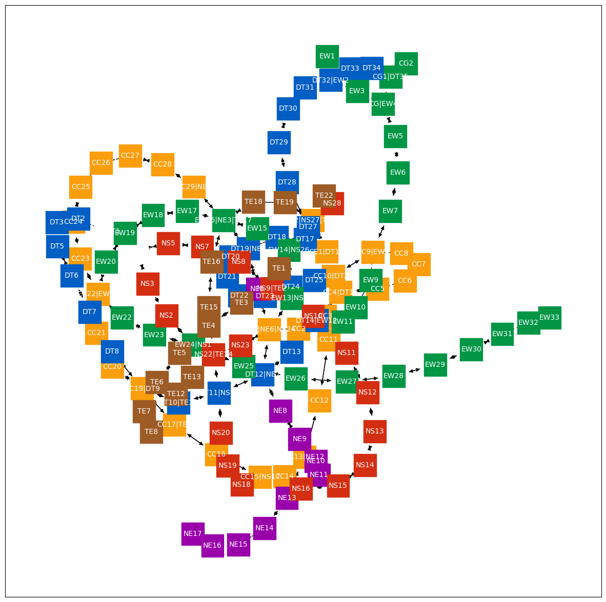
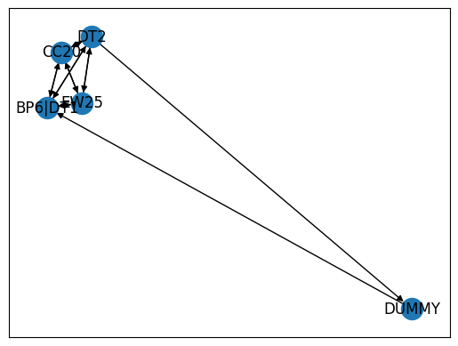
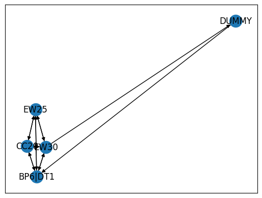
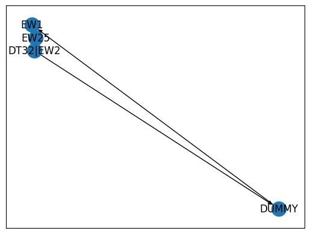

## MRT Stations SG

Given the raw data from Wikipedia, we want to construct a graph of the MRT stations and find the shortest path between stations.


```python
data = [
    ["NS1  EW24", "Jurong East"],
    ["NS2", "Bukit Batok"],
    ["NS3", "Bukit Gombak"],
    ["NS4  BP1", "Choa Chu Kang"],
    ["NS5", "Yew Tee"],
    ["NS7", "Kranji"],
    ["NS8", "Marsiling"],
    ["NS9  TE2", "Woodlands"],
    ["NS10", "Admiralty"],
    ["NS11", "Sembawang"],
    ["NS12", "Canberra"],
    ["NS13", "Yishun"],
    ["NS14", "Khatib"],
    ["NS15", "Yio Chu Kang"],
    ["NS16", "Ang Mo Kio"],
    ["NS17  CC15", "Bishan"],
    ["NS18", "Braddell"],
    ["NS19", "Toa Payoh"],
    ["NS20", "Novena"],
    ["NS21 – DT11", "Newton"],
    ["NS22  TE14", "Orchard"],
    ["NS23", "Somerset"],
    ["NS24  NE6  CC1", "Dhoby Ghaut"],
    ["NS25  EW13", "City Hall"],
    ["NS26  EW14", "Raffles Place"],
    ["NS27  CE2  TE20", "Marina Bay"],
    ["NS28", "Marina South Pier"],
    ["EW1", "Pasir Ris"],
    ["EW2 – DT32", "Tampines"],
    ["EW3", "Simei"],
    ["EW4   CG", "Tanah Merah"],
    ["EW5", "Bedok"],
    ["EW6", "Kembangan"],
    ["EW7", "Eunos"],
    ["EW8  CC9", "Paya Lebar"],
    ["EW9", "Aljunied"],
    ["EW10", "Kallang"],
    ["EW11", "Lavender"],
    ["EW12  DT14", "Bugis"],
    ["EW13  NS25", "City Hall"],
    ["EW14  NS26", "Raffles Place"],
    ["EW15", "Tanjong Pagar"],
    ["EW16  NE3  TE17", "Outram Park"],
    ["EW17", "Tiong Bahru"],
    ["EW18", "Redhill"],
    ["EW19", "Queenstown"],
    ["EW20", "Commonwealth"],
    ["EW21  CC22", "Buona Vista"],
    ["EW22", "Dover"],
    ["EW23", "Clementi"],
    ["EW24  NS1", "Jurong East"],
    ["EW25", "Chinese Garden"],
    ["EW26", "Lakeside"],
    ["EW27", "Boon Lay"],
    ["EW28", "Pioneer"],
    ["EW29", "Joo Koon"],
    ["EW30", "Gul Circle"],
    ["EW31", "Tuas Crescent"],
    ["EW32", "Tuas West Road"],
    ["EW33", "Tuas Link"],
    ["CG1  DT35", "Expo"],
    ["CG2", "Changi Airport"],
    ["NE1  CC29", "HarbourFront"],
    ["NE3  EW16  TE17", "Outram Park"],
    ["NE4  DT19", "Chinatown"],
    ["NE5", "Clarke Quay"],
    ["NE6  NS24  CC1", "Dhoby Ghaut"],
    ["NE7  DT12", "Little India"],
    ["NE8", "Farrer Park"],
    ["NE9", "Boon Keng"],
    ["NE10", "Potong Pasir"],
    ["NE11", "Woodleigh"],
    ["NE12  CC13", "Serangoon"],
    ["NE13", "Kovan"],
    ["NE14", "Hougang"],
    ["NE15", "Buangkok"],
    ["NE16  STC", "Sengkang"],
    ["NE17  PTC", "Punggol"],
    ["CC1  NS24  NE6", "Dhoby Ghaut"],
    ["CC2", "Bras Basah"],
    ["CC3", "Esplanade"],
    ["CC4  DT15", "Promenade"],
    ["CC5", "Nicoll Highway"],
    ["CC6", "Stadium"],
    ["CC7", "Mountbatten"],
    ["CC8", "Dakota"],
    ["CC9  EW8", "Paya Lebar"],
    ["CC10  DT26", "MacPherson"],
    ["CC11", "Tai Seng"],
    ["CC12", "Bartley"],
    ["CC13  NE12", "Serangoon"],
    ["CC14", "Lorong Chuan"],
    ["CC15  NS17", "Bishan"],
    ["CC16", "Marymount"],
    ["CC17  TE9", "Caldecott"],
    ["CC19  DT9", "Botanic Gardens • Kebun Bunga"],
    ["CC20", "Farrer Road"],
    ["CC21", "Holland Village"],
    ["CC22  EW21", "Buona Vista"],
    ["CC23", "one-north"],
    ["CC24", "Kent Ridge"],
    ["CC25", "Haw Par Villa"],
    ["CC26", "Pasir Panjang"],
    ["CC27", "Labrador Park"],
    ["CC28", "Telok Blangah"],
    ["CC29  NE1", "HarbourFront"],
    ["CE1  DT16", "Bayfront"],
    ["CE2  NS27  TE20", "Marina Bay"],
    ["DT1 – BP6", "Bukit Panjang"],
    ["DT2", "Cashew"],
    ["DT3", "Hillview"],
    ["DT5", "Beauty World"],
    ["DT6", "King Albert Park"],
    ["DT7", "Sixth Avenue"],
    ["DT8", "Tan Kah Kee"],
    ["DT9  CC19", "Botanic Gardens • Kebun Bunga"],
    ["DT10  TE11", "Stevens"],
    ["DT11 – NS21", "Newton"],
    ["DT12  NE7", "Little India"],
    ["DT13", "Rochor"],
    ["DT14  EW12", "Bugis"],
    ["DT15  CC4", "Promenade"],
    ["DT16  CE1", "Bayfront"],
    ["DT17", "Downtown"],
    ["DT18", "Telok Ayer"],
    ["DT19  NE4", "Chinatown"],
    ["DT20", "Fort Canning"],
    ["DT21", "Bencoolen"],
    ["DT22", "Jalan Besar"],
    ["DT23", "Bendemeer"],
    ["DT24", "Geylang Bahru"],
    ["DT25", "Mattar"],
    ["DT26  CC10", "MacPherson"],
    ["DT27", "Ubi"],
    ["DT28", "Kaki Bukit"],
    ["DT29", "Bedok North"],
    ["DT30", "Bedok Reservoir"],
    ["DT31", "Tampines West"],
    ["DT32 – EW2", "Tampines"],
    ["DT33", "Tampines East"],
    ["DT34", "Upper Changi"],
    ["DT35  CG1", "Expo"],
    ["TE1", "Woodlands North"],
    ["TE2  NS9", "Woodlands"],
    ["TE3", "Woodlands South"],
    ["TE4", "Springleaf"],
    ["TE5", "Lentor"],
    ["TE6", "Mayflower"],
    ["TE7", "Bright Hill"],
    ["TE8", "Upper Thomson"],
    ["TE9  CC17", "Caldecott"],
    ["TE11  DT10", "Stevens"],
    ["TE12", "Napier"],
    ["TE13", "Orchard Boulevard"],
    ["TE14  NS22", "Orchard"],
    ["TE15", "Great World"],
    ["TE16", "Havelock"],
    ["TE17  EW16  NE3", "Outram Park"],
    ["TE18", "Maxwell"],
    ["TE19", "Shenton Way"],
    ["TE20  NS27  CE2", "Marina Bay"],
    ["TE22", "Gardens by the Bay • Taman di Pesisiran"],
    ["CG2", "Changi Airport"],
    ["CG1  DT35", "Expo"],
    ["EW4   CG", "Tanah Merah"],
    ["NS4  BP1", "Choa Chu Kang"],
    ["EW27", "Boon Lay"],
    ["NS1  EW24", "Jurong East"],
    ["CC25", "Haw Par Villa"],
    ["EW1", "Pasir Ris"],
    ["NE14", "Hougang"],
    ["NS16", "Ang Mo Kio"],
    ["TE7", "Bright Hill"],
    ["DT6", "King Albert Park"],
    ["EW23", "Clementi"],
    ["PE4", "Riviera"],
    ["NE17  PTC", "Punggol"],
]
len(data)
```


    177


We want to first clean the station codes. Note that some stations are _interchange_, which means they connect to multiple stations.

We need to know which stations are interchange, so that we can link those stations together.


```python
from collections import namedtuple

Station = namedtuple("Station", "codes name")

exclude_codes = ["STC", "PTC"]

stations = []
for codes, name in data:
    clean_name = name.strip()
    clean_codes = sorted(
        [
            code.strip()
            for code in codes.split("\xa0")
            if len(code.strip()) > 1 and code.strip() not in exclude_codes
        ]
    )
    stations.append(Station(clean_codes, clean_name))
stations
```


    [Station(codes=['EW24', 'NS1'], name='Jurong East'),
     Station(codes=['NS2'], name='Bukit Batok'),
     Station(codes=['NS3'], name='Bukit Gombak'),
     Station(codes=['BP1', 'NS4'], name='Choa Chu Kang'),
     Station(codes=['NS5'], name='Yew Tee'),
     Station(codes=['NS7'], name='Kranji'),
     Station(codes=['NS8'], name='Marsiling'),
     Station(codes=['NS9', 'TE2'], name='Woodlands'),
     Station(codes=['NS10'], name='Admiralty'),
     Station(codes=['NS11'], name='Sembawang'),
     Station(codes=['NS12'], name='Canberra'),
     Station(codes=['NS13'], name='Yishun'),
     Station(codes=['NS14'], name='Khatib'),
     Station(codes=['NS15'], name='Yio Chu Kang'),
     Station(codes=['NS16'], name='Ang Mo Kio'),
     Station(codes=['CC15', 'NS17'], name='Bishan'),
     Station(codes=['NS18'], name='Braddell'),
     Station(codes=['NS19'], name='Toa Payoh'),
     Station(codes=['NS20'], name='Novena'),
     Station(codes=['DT11', 'NS21'], name='Newton'),
     Station(codes=['NS22', 'TE14'], name='Orchard'),
     Station(codes=['NS23'], name='Somerset'),
     Station(codes=['CC1', 'NE6', 'NS24'], name='Dhoby Ghaut'),
     Station(codes=['EW13', 'NS25'], name='City Hall'),
     Station(codes=['EW14', 'NS26'], name='Raffles Place'),
     Station(codes=['CE2', 'NS27', 'TE20'], name='Marina Bay'),
     Station(codes=['NS28'], name='Marina South Pier'),
     Station(codes=['EW1'], name='Pasir Ris'),
     Station(codes=['DT32', 'EW2'], name='Tampines'),
     Station(codes=['EW3'], name='Simei'),
     Station(codes=['CG', 'EW4'], name='Tanah Merah'),
     Station(codes=['EW5'], name='Bedok'),
     Station(codes=['EW6'], name='Kembangan'),
     Station(codes=['EW7'], name='Eunos'),
     Station(codes=['CC9', 'EW8'], name='Paya Lebar'),
     Station(codes=['EW9'], name='Aljunied'),
     Station(codes=['EW10'], name='Kallang'),
     Station(codes=['EW11'], name='Lavender'),
     Station(codes=['DT14', 'EW12'], name='Bugis'),
     Station(codes=['EW13', 'NS25'], name='City Hall'),
     Station(codes=['EW14', 'NS26'], name='Raffles Place'),
     Station(codes=['EW15'], name='Tanjong Pagar'),
     Station(codes=['EW16', 'NE3', 'TE17'], name='Outram Park'),
     Station(codes=['EW17'], name='Tiong Bahru'),
     Station(codes=['EW18'], name='Redhill'),
     Station(codes=['EW19'], name='Queenstown'),
     Station(codes=['EW20'], name='Commonwealth'),
     Station(codes=['CC22', 'EW21'], name='Buona Vista'),
     Station(codes=['EW22'], name='Dover'),
     Station(codes=['EW23'], name='Clementi'),
     Station(codes=['EW24', 'NS1'], name='Jurong East'),
     Station(codes=['EW25'], name='Chinese Garden'),
     Station(codes=['EW26'], name='Lakeside'),
     Station(codes=['EW27'], name='Boon Lay'),
     Station(codes=['EW28'], name='Pioneer'),
     Station(codes=['EW29'], name='Joo Koon'),
     Station(codes=['EW30'], name='Gul Circle'),
     Station(codes=['EW31'], name='Tuas Crescent'),
     Station(codes=['EW32'], name='Tuas West Road'),
     Station(codes=['EW33'], name='Tuas Link'),
     Station(codes=['CG1', 'DT35'], name='Expo'),
     Station(codes=['CG2'], name='Changi Airport'),
     Station(codes=['CC29', 'NE1'], name='HarbourFront'),
     Station(codes=['EW16', 'NE3', 'TE17'], name='Outram Park'),
     Station(codes=['DT19', 'NE4'], name='Chinatown'),
     Station(codes=['NE5'], name='Clarke Quay'),
     Station(codes=['CC1', 'NE6', 'NS24'], name='Dhoby Ghaut'),
     Station(codes=['DT12', 'NE7'], name='Little India'),
     Station(codes=['NE8'], name='Farrer Park'),
     Station(codes=['NE9'], name='Boon Keng'),
     Station(codes=['NE10'], name='Potong Pasir'),
     Station(codes=['NE11'], name='Woodleigh'),
     Station(codes=['CC13', 'NE12'], name='Serangoon'),
     Station(codes=['NE13'], name='Kovan'),
     Station(codes=['NE14'], name='Hougang'),
     Station(codes=['NE15'], name='Buangkok'),
     Station(codes=['NE16'], name='Sengkang'),
     Station(codes=['NE17'], name='Punggol'),
     Station(codes=['CC1', 'NE6', 'NS24'], name='Dhoby Ghaut'),
     Station(codes=['CC2'], name='Bras Basah'),
     Station(codes=['CC3'], name='Esplanade'),
     Station(codes=['CC4', 'DT15'], name='Promenade'),
     Station(codes=['CC5'], name='Nicoll Highway'),
     Station(codes=['CC6'], name='Stadium'),
     Station(codes=['CC7'], name='Mountbatten'),
     Station(codes=['CC8'], name='Dakota'),
     Station(codes=['CC9', 'EW8'], name='Paya Lebar'),
     Station(codes=['CC10', 'DT26'], name='MacPherson'),
     Station(codes=['CC11'], name='Tai Seng'),
     Station(codes=['CC12'], name='Bartley'),
     Station(codes=['CC13', 'NE12'], name='Serangoon'),
     Station(codes=['CC14'], name='Lorong Chuan'),
     Station(codes=['CC15', 'NS17'], name='Bishan'),
     Station(codes=['CC16'], name='Marymount'),
     Station(codes=['CC17', 'TE9'], name='Caldecott'),
     Station(codes=['CC19', 'DT9'], name='Botanic Gardens • Kebun Bunga'),
     Station(codes=['CC20'], name='Farrer Road'),
     Station(codes=['CC21'], name='Holland Village'),
     Station(codes=['CC22', 'EW21'], name='Buona Vista'),
     Station(codes=['CC23'], name='one-north'),
     Station(codes=['CC24'], name='Kent Ridge'),
     Station(codes=['CC25'], name='Haw Par Villa'),
     Station(codes=['CC26'], name='Pasir Panjang'),
     Station(codes=['CC27'], name='Labrador Park'),
     Station(codes=['CC28'], name='Telok Blangah'),
     Station(codes=['CC29', 'NE1'], name='HarbourFront'),
     Station(codes=['CE1', 'DT16'], name='Bayfront'),
     Station(codes=['CE2', 'NS27', 'TE20'], name='Marina Bay'),
     Station(codes=['BP6', 'DT1'], name='Bukit Panjang'),
     Station(codes=['DT2'], name='Cashew'),
     Station(codes=['DT3'], name='Hillview'),
     Station(codes=['DT5'], name='Beauty World'),
     Station(codes=['DT6'], name='King Albert Park'),
     Station(codes=['DT7'], name='Sixth Avenue'),
     Station(codes=['DT8'], name='Tan Kah Kee'),
     Station(codes=['CC19', 'DT9'], name='Botanic Gardens • Kebun Bunga'),
     Station(codes=['DT10', 'TE11'], name='Stevens'),
     Station(codes=['DT11', 'NS21'], name='Newton'),
     Station(codes=['DT12', 'NE7'], name='Little India'),
     Station(codes=['DT13'], name='Rochor'),
     Station(codes=['DT14', 'EW12'], name='Bugis'),
     Station(codes=['CC4', 'DT15'], name='Promenade'),
     Station(codes=['CE1', 'DT16'], name='Bayfront'),
     Station(codes=['DT17'], name='Downtown'),
     Station(codes=['DT18'], name='Telok Ayer'),
     Station(codes=['DT19', 'NE4'], name='Chinatown'),
     Station(codes=['DT20'], name='Fort Canning'),
     Station(codes=['DT21'], name='Bencoolen'),
     Station(codes=['DT22'], name='Jalan Besar'),
     Station(codes=['DT23'], name='Bendemeer'),
     Station(codes=['DT24'], name='Geylang Bahru'),
     Station(codes=['DT25'], name='Mattar'),
     Station(codes=['CC10', 'DT26'], name='MacPherson'),
     Station(codes=['DT27'], name='Ubi'),
     Station(codes=['DT28'], name='Kaki Bukit'),
     Station(codes=['DT29'], name='Bedok North'),
     Station(codes=['DT30'], name='Bedok Reservoir'),
     Station(codes=['DT31'], name='Tampines West'),
     Station(codes=['DT32', 'EW2'], name='Tampines'),
     Station(codes=['DT33'], name='Tampines East'),
     Station(codes=['DT34'], name='Upper Changi'),
     Station(codes=['CG1', 'DT35'], name='Expo'),
     Station(codes=['TE1'], name='Woodlands North'),
     Station(codes=['NS9', 'TE2'], name='Woodlands'),
     Station(codes=['TE3'], name='Woodlands South'),
     Station(codes=['TE4'], name='Springleaf'),
     Station(codes=['TE5'], name='Lentor'),
     Station(codes=['TE6'], name='Mayflower'),
     Station(codes=['TE7'], name='Bright Hill'),
     Station(codes=['TE8'], name='Upper Thomson'),
     Station(codes=['CC17', 'TE9'], name='Caldecott'),
     Station(codes=['DT10', 'TE11'], name='Stevens'),
     Station(codes=['TE12'], name='Napier'),
     Station(codes=['TE13'], name='Orchard Boulevard'),
     Station(codes=['NS22', 'TE14'], name='Orchard'),
     Station(codes=['TE15'], name='Great World'),
     Station(codes=['TE16'], name='Havelock'),
     Station(codes=['EW16', 'NE3', 'TE17'], name='Outram Park'),
     Station(codes=['TE18'], name='Maxwell'),
     Station(codes=['TE19'], name='Shenton Way'),
     Station(codes=['CE2', 'NS27', 'TE20'], name='Marina Bay'),
     Station(codes=['TE22'], name='Gardens by the Bay • Taman di Pesisiran'),
     Station(codes=['CG2'], name='Changi Airport'),
     Station(codes=['CG1', 'DT35'], name='Expo'),
     Station(codes=['CG', 'EW4'], name='Tanah Merah'),
     Station(codes=['BP1', 'NS4'], name='Choa Chu Kang'),
     Station(codes=['EW27'], name='Boon Lay'),
     Station(codes=['EW24', 'NS1'], name='Jurong East'),
     Station(codes=['CC25'], name='Haw Par Villa'),
     Station(codes=['EW1'], name='Pasir Ris'),
     Station(codes=['NE14'], name='Hougang'),
     Station(codes=['NS16'], name='Ang Mo Kio'),
     Station(codes=['TE7'], name='Bright Hill'),
     Station(codes=['DT6'], name='King Albert Park'),
     Station(codes=['EW23'], name='Clementi'),
     Station(codes=['PE4'], name='Riviera'),
     Station(codes=['NE17'], name='Punggol')]


```python
codes = set(sum(map(lambda it: it.codes, stations), []))
codes = sorted(codes, key=lambda code: [code[:2], int(code[2:] or 0)])
codes[:10]
```


    ['BP1', 'BP6', 'CC1', 'CC2', 'CC3', 'CC4', 'CC5', 'CC6', 'CC7', 'CC8']


```python
interchanges = {}
for station in stations:
    if len(station.codes) == 1:
        continue

    combined = "|".join(station.codes)
    for code in station.codes:
        interchanges[code] = combined

interchanges
```


    {'EW24': 'EW24|NS1',
     'NS1': 'EW24|NS1',
     'BP1': 'BP1|NS4',
     'NS4': 'BP1|NS4',
     'NS9': 'NS9|TE2',
     'TE2': 'NS9|TE2',
     'CC15': 'CC15|NS17',
     'NS17': 'CC15|NS17',
     'DT11': 'DT11|NS21',
     'NS21': 'DT11|NS21',
     'NS22': 'NS22|TE14',
     'TE14': 'NS22|TE14',
     'CC1': 'CC1|NE6|NS24',
     'NE6': 'CC1|NE6|NS24',
     'NS24': 'CC1|NE6|NS24',
     'EW13': 'EW13|NS25',
     'NS25': 'EW13|NS25',
     'EW14': 'EW14|NS26',
     'NS26': 'EW14|NS26',
     'CE2': 'CE2|NS27|TE20',
     'NS27': 'CE2|NS27|TE20',
     'TE20': 'CE2|NS27|TE20',
     'DT32': 'DT32|EW2',
     'EW2': 'DT32|EW2',
     'CG': 'CG|EW4',
     'EW4': 'CG|EW4',
     'CC9': 'CC9|EW8',
     'EW8': 'CC9|EW8',
     'DT14': 'DT14|EW12',
     'EW12': 'DT14|EW12',
     'EW16': 'EW16|NE3|TE17',
     'NE3': 'EW16|NE3|TE17',
     'TE17': 'EW16|NE3|TE17',
     'CC22': 'CC22|EW21',
     'EW21': 'CC22|EW21',
     'CG1': 'CG1|DT35',
     'DT35': 'CG1|DT35',
     'CC29': 'CC29|NE1',
     'NE1': 'CC29|NE1',
     'DT19': 'DT19|NE4',
     'NE4': 'DT19|NE4',
     'DT12': 'DT12|NE7',
     'NE7': 'DT12|NE7',
     'CC13': 'CC13|NE12',
     'NE12': 'CC13|NE12',
     'CC4': 'CC4|DT15',
     'DT15': 'CC4|DT15',
     'CC10': 'CC10|DT26',
     'DT26': 'CC10|DT26',
     'CC17': 'CC17|TE9',
     'TE9': 'CC17|TE9',
     'CC19': 'CC19|DT9',
     'DT9': 'CC19|DT9',
     'CE1': 'CE1|DT16',
     'DT16': 'CE1|DT16',
     'BP6': 'BP6|DT1',
     'DT1': 'BP6|DT1',
     'DT10': 'DT10|TE11',
     'TE11': 'DT10|TE11'}


```python
from itertools import groupby

import networkx as nx

G = nx.DiGraph()
for prefix, group in groupby(codes, key=lambda code: code[:2]):
    codes = list(group)
    codes = [interchanges[code] if code in interchanges else code for code in codes]
    # print(prefix, codes)

    links = zip(codes, codes[1:])
    for a, b in links:
        G.add_edge(a, b)
        G.add_edge(b, a)
```


```python
color_map = {
    "NS": "#d42e12",
    "EW": "#009645",
    "CG": "#009645",
    "NE": "#9900aa",
    "CC": "#fa9e0d",
    "DT": "#005ec4",
    "TE": "#9D5B25",
    "CE": "#fa9e0d",
    "BP": "white",
}

node_color = []
for node in G:
    node_color.append(color_map[node[:2]])
```


```python
from matplotlib.pyplot import subplots

ax = subplots(figsize=(15, 15))[1]

nx.draw_networkx(
    G,
    ax=ax,
    node_color=node_color,
    node_size=1000,
    node_shape="s",
    font_color="white",
    font_size=10,
)
```


    

    


```python
name_by_code = {}
for station in stations:
    name_by_code["|".join(station.codes)] = station.name
name_by_code
```


    {'EW24|NS1': 'Jurong East',
     'NS2': 'Bukit Batok',
     'NS3': 'Bukit Gombak',
     'BP1|NS4': 'Choa Chu Kang',
     'NS5': 'Yew Tee',
     'NS7': 'Kranji',
     'NS8': 'Marsiling',
     'NS9|TE2': 'Woodlands',
     'NS10': 'Admiralty',
     'NS11': 'Sembawang',
     'NS12': 'Canberra',
     'NS13': 'Yishun',
     'NS14': 'Khatib',
     'NS15': 'Yio Chu Kang',
     'NS16': 'Ang Mo Kio',
     'CC15|NS17': 'Bishan',
     'NS18': 'Braddell',
     'NS19': 'Toa Payoh',
     'NS20': 'Novena',
     'DT11|NS21': 'Newton',
     'NS22|TE14': 'Orchard',
     'NS23': 'Somerset',
     'CC1|NE6|NS24': 'Dhoby Ghaut',
     'EW13|NS25': 'City Hall',
     'EW14|NS26': 'Raffles Place',
     'CE2|NS27|TE20': 'Marina Bay',
     'NS28': 'Marina South Pier',
     'EW1': 'Pasir Ris',
     'DT32|EW2': 'Tampines',
     'EW3': 'Simei',
     'CG|EW4': 'Tanah Merah',
     'EW5': 'Bedok',
     'EW6': 'Kembangan',
     'EW7': 'Eunos',
     'CC9|EW8': 'Paya Lebar',
     'EW9': 'Aljunied',
     'EW10': 'Kallang',
     'EW11': 'Lavender',
     'DT14|EW12': 'Bugis',
     'EW15': 'Tanjong Pagar',
     'EW16|NE3|TE17': 'Outram Park',
     'EW17': 'Tiong Bahru',
     'EW18': 'Redhill',
     'EW19': 'Queenstown',
     'EW20': 'Commonwealth',
     'CC22|EW21': 'Buona Vista',
     'EW22': 'Dover',
     'EW23': 'Clementi',
     'EW25': 'Chinese Garden',
     'EW26': 'Lakeside',
     'EW27': 'Boon Lay',
     'EW28': 'Pioneer',
     'EW29': 'Joo Koon',
     'EW30': 'Gul Circle',
     'EW31': 'Tuas Crescent',
     'EW32': 'Tuas West Road',
     'EW33': 'Tuas Link',
     'CG1|DT35': 'Expo',
     'CG2': 'Changi Airport',
     'CC29|NE1': 'HarbourFront',
     'DT19|NE4': 'Chinatown',
     'NE5': 'Clarke Quay',
     'DT12|NE7': 'Little India',
     'NE8': 'Farrer Park',
     'NE9': 'Boon Keng',
     'NE10': 'Potong Pasir',
     'NE11': 'Woodleigh',
     'CC13|NE12': 'Serangoon',
     'NE13': 'Kovan',
     'NE14': 'Hougang',
     'NE15': 'Buangkok',
     'NE16': 'Sengkang',
     'NE17': 'Punggol',
     'CC2': 'Bras Basah',
     'CC3': 'Esplanade',
     'CC4|DT15': 'Promenade',
     'CC5': 'Nicoll Highway',
     'CC6': 'Stadium',
     'CC7': 'Mountbatten',
     'CC8': 'Dakota',
     'CC10|DT26': 'MacPherson',
     'CC11': 'Tai Seng',
     'CC12': 'Bartley',
     'CC14': 'Lorong Chuan',
     'CC16': 'Marymount',
     'CC17|TE9': 'Caldecott',
     'CC19|DT9': 'Botanic Gardens • Kebun Bunga',
     'CC20': 'Farrer Road',
     'CC21': 'Holland Village',
     'CC23': 'one-north',
     'CC24': 'Kent Ridge',
     'CC25': 'Haw Par Villa',
     'CC26': 'Pasir Panjang',
     'CC27': 'Labrador Park',
     'CC28': 'Telok Blangah',
     'CE1|DT16': 'Bayfront',
     'BP6|DT1': 'Bukit Panjang',
     'DT2': 'Cashew',
     'DT3': 'Hillview',
     'DT5': 'Beauty World',
     'DT6': 'King Albert Park',
     'DT7': 'Sixth Avenue',
     'DT8': 'Tan Kah Kee',
     'DT10|TE11': 'Stevens',
     'DT13': 'Rochor',
     'DT17': 'Downtown',
     'DT18': 'Telok Ayer',
     'DT20': 'Fort Canning',
     'DT21': 'Bencoolen',
     'DT22': 'Jalan Besar',
     'DT23': 'Bendemeer',
     'DT24': 'Geylang Bahru',
     'DT25': 'Mattar',
     'DT27': 'Ubi',
     'DT28': 'Kaki Bukit',
     'DT29': 'Bedok North',
     'DT30': 'Bedok Reservoir',
     'DT31': 'Tampines West',
     'DT33': 'Tampines East',
     'DT34': 'Upper Changi',
     'TE1': 'Woodlands North',
     'TE3': 'Woodlands South',
     'TE4': 'Springleaf',
     'TE5': 'Lentor',
     'TE6': 'Mayflower',
     'TE7': 'Bright Hill',
     'TE8': 'Upper Thomson',
     'TE12': 'Napier',
     'TE13': 'Orchard Boulevard',
     'TE15': 'Great World',
     'TE16': 'Havelock',
     'TE18': 'Maxwell',
     'TE19': 'Shenton Way',
     'TE22': 'Gardens by the Bay • Taman di Pesisiran',
     'PE4': 'Riviera'}


```python
def shortest_path(a, b):
    a = interchanges[a] if a in interchanges else a
    b = interchanges[b] if b in interchanges else b
    paths = nx.shortest_path(G, a, b)
    names = [name_by_code[path] for path in paths]
    return list(zip(paths, names)), len(paths)


shortest_path("CE1", "EW1")
```


    ([('CE1|DT16', 'Bayfront'),
      ('CC4|DT15', 'Promenade'),
      ('CC5', 'Nicoll Highway'),
      ('CC6', 'Stadium'),
      ('CC7', 'Mountbatten'),
      ('CC8', 'Dakota'),
      ('CC9|EW8', 'Paya Lebar'),
      ('EW7', 'Eunos'),
      ('EW6', 'Kembangan'),
      ('EW5', 'Bedok'),
      ('CG|EW4', 'Tanah Merah'),
      ('EW3', 'Simei'),
      ('DT32|EW2', 'Tampines'),
      ('EW1', 'Pasir Ris')],
     14)


```python
# https://networkx.org/documentation/stable/reference/algorithms/approximation.html
# https://stackoverflow.com/questions/14527815/how-to-fix-the-start-and-end-points-in-travelling-salesmen-problem
from itertools import combinations

from networkx.algorithms import approximation


def shortest_path_with_stops(start, end, stops=[]):
    H = nx.DiGraph()

    dummy = "DUMMY"
    start = interchanges[start] if start in interchanges else start
    end = interchanges[end] if end in interchanges else end
    H.add_edge(dummy, start, weight=0)
    H.add_edge(end, dummy, weight=0)
    H.add_edge(
        start, end, weight=100000
    )  # So that start doesn't connect to end immediately.
    H.add_edge(
        end, start, weight=100000
    )  # So that start doesn't connect to end immediately.
    exclude = [start, end]
    nodes = [start, end, *stops]
    nodes = [interchanges[node] if node in interchanges else node for node in nodes]
    stops = {}
    for start, end in combinations(nodes, 2):
        stops[(start, end)] = nx.shortest_path(G, start, end)
        stops[(end, start)] = nx.shortest_path(G, end, start)
        H.add_edge(start, end, weight=nx.shortest_path_length(G, start, end))
        H.add_edge(end, start, weight=nx.shortest_path_length(G, end, start))
    nx.draw_networkx(H)
    paths = approximation.traveling_salesman_problem(H)
    if paths[-1] == exclude[0]:
        paths.pop()
    if paths[-1] == "DUMMY":
        paths.pop()
    print(paths)
    final = []
    for a, b in zip(paths, paths[1:]):
        next_stops = stops[(a, b)]
        if len(final) > 0 and final[-1] == next_stops[0]:
            final.extend(next_stops[1:])
        else:
            final.extend(next_stops)
    names = [name_by_code[path] for path in final]
    return list(zip(final, names)), len(final)


shortest_path_with_stops("DT1", "DT2", ["EW25", "CC20"])
```

    ['BP6|DT1', 'EW25', 'CC20', 'DT2']


    ([('BP6|DT1', 'Bukit Panjang'),
      ('BP1|NS4', 'Choa Chu Kang'),
      ('NS3', 'Bukit Gombak'),
      ('NS2', 'Bukit Batok'),
      ('EW24|NS1', 'Jurong East'),
      ('EW25', 'Chinese Garden'),
      ('EW24|NS1', 'Jurong East'),
      ('EW23', 'Clementi'),
      ('EW22', 'Dover'),
      ('CC22|EW21', 'Buona Vista'),
      ('CC21', 'Holland Village'),
      ('CC20', 'Farrer Road'),
      ('CC19|DT9', 'Botanic Gardens • Kebun Bunga'),
      ('DT8', 'Tan Kah Kee'),
      ('DT7', 'Sixth Avenue'),
      ('DT6', 'King Albert Park'),
      ('DT5', 'Beauty World'),
      ('DT3', 'Hillview'),
      ('DT2', 'Cashew')],
     19)


    

    


```python
shortest_path_with_stops("DT1", "EW30", ["EW25", "CC20"])
```

    ['BP6|DT1', 'CC20', 'EW25', 'EW30']


    ([('BP6|DT1', 'Bukit Panjang'),
      ('DT2', 'Cashew'),
      ('DT3', 'Hillview'),
      ('DT5', 'Beauty World'),
      ('DT6', 'King Albert Park'),
      ('DT7', 'Sixth Avenue'),
      ('DT8', 'Tan Kah Kee'),
      ('CC19|DT9', 'Botanic Gardens • Kebun Bunga'),
      ('CC20', 'Farrer Road'),
      ('CC21', 'Holland Village'),
      ('CC22|EW21', 'Buona Vista'),
      ('EW22', 'Dover'),
      ('EW23', 'Clementi'),
      ('EW24|NS1', 'Jurong East'),
      ('EW25', 'Chinese Garden'),
      ('EW26', 'Lakeside'),
      ('EW27', 'Boon Lay'),
      ('EW28', 'Pioneer'),
      ('EW29', 'Joo Koon'),
      ('EW30', 'Gul Circle')],
     20)


    

    


```python
# NOTE: We cannot set the first and last station to equal the same one.
# But we can set it to one stop before/after the start station.
shortest_path_with_stops("EW1", "EW2", ["EW25"])
```

    ['EW1', 'EW25', 'DT32|EW2']


    ([('EW1', 'Pasir Ris'),
      ('DT32|EW2', 'Tampines'),
      ('DT31', 'Tampines West'),
      ('DT30', 'Bedok Reservoir'),
      ('DT29', 'Bedok North'),
      ('DT28', 'Kaki Bukit'),
      ('DT27', 'Ubi'),
      ('CC10|DT26', 'MacPherson'),
      ('CC11', 'Tai Seng'),
      ('CC12', 'Bartley'),
      ('CC13|NE12', 'Serangoon'),
      ('CC14', 'Lorong Chuan'),
      ('CC15|NS17', 'Bishan'),
      ('CC16', 'Marymount'),
      ('CC17|TE9', 'Caldecott'),
      ('CC19|DT9', 'Botanic Gardens • Kebun Bunga'),
      ('CC20', 'Farrer Road'),
      ('CC21', 'Holland Village'),
      ('CC22|EW21', 'Buona Vista'),
      ('EW22', 'Dover'),
      ('EW23', 'Clementi'),
      ('EW24|NS1', 'Jurong East'),
      ('EW25', 'Chinese Garden'),
      ('EW24|NS1', 'Jurong East'),
      ('EW23', 'Clementi'),
      ('EW22', 'Dover'),
      ('CC22|EW21', 'Buona Vista'),
      ('CC21', 'Holland Village'),
      ('CC20', 'Farrer Road'),
      ('CC19|DT9', 'Botanic Gardens • Kebun Bunga'),
      ('CC17|TE9', 'Caldecott'),
      ('CC16', 'Marymount'),
      ('CC15|NS17', 'Bishan'),
      ('CC14', 'Lorong Chuan'),
      ('CC13|NE12', 'Serangoon'),
      ('CC12', 'Bartley'),
      ('CC11', 'Tai Seng'),
      ('CC10|DT26', 'MacPherson'),
      ('DT27', 'Ubi'),
      ('DT28', 'Kaki Bukit'),
      ('DT29', 'Bedok North'),
      ('DT30', 'Bedok Reservoir'),
      ('DT31', 'Tampines West'),
      ('DT32|EW2', 'Tampines')],
     44)


    

    

