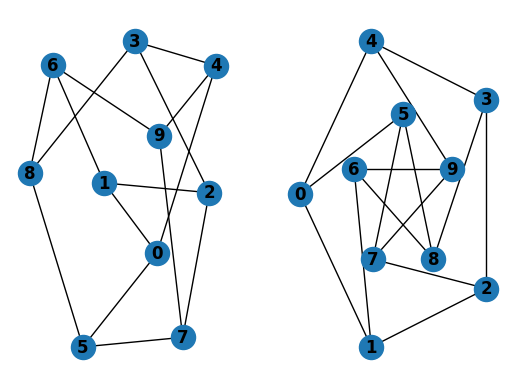
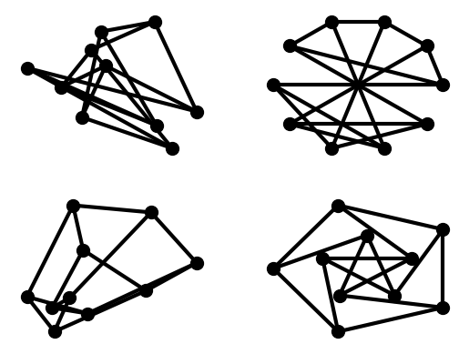
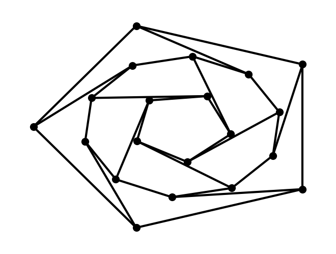
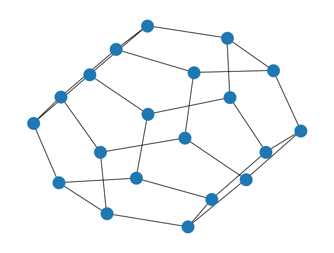

# Networkx Basics

https://networkx.org/documentation/stable/tutorial.html

## Creating a graph


```python
import networkx as nx

G = nx.Graph()
```

## Nodes


```python
G.add_node(1)
G.add_nodes_from([2, 3])
G.add_nodes_from([(4, {"color": "red"}), (5, {"color": "green"})])
```


```python
H = nx.path_graph(10)
G.add_nodes_from(H)
G.add_node(H)
```

## Edges


```python
G.add_edge(1, 2)
e = (2, 3)
G.add_edge(*e)  # Unpack edge tuple.
```


```python
G.add_edges_from([(1, 2), (1, 3)])
```


```python
G.add_edges_from(H.edges)
```


```python
G.clear()
```


```python
G.add_edges_from([(1, 2), (1, 3)])
G.add_node(1)
G.add_edge(1, 2)
G.add_node("spam")  # adds node "spam"
G.add_nodes_from("spam")  # adds 4 nodes: 's', 'p', 'a', 'm'
G.add_edge(3, "m")
```


```python
G.number_of_nodes()
```


    8


```python
G.number_of_edges()
```


    3


```python
DG = nx.DiGraph()
DG.add_edge(2, 1)
DG.add_edge(1, 3)
DG.add_edge(2, 4)
DG.add_edge(1, 2)
assert list(DG.successors(2)) == [1, 4]
assert list(DG.successors(1)) == [3, 2]
# This follows the order of the adjacencies.
assert list(DG.edges) == [(2, 1), (2, 4), (1, 3), (1, 2)]
DG.adj
```


    AdjacencyView({2: {1: {}, 4: {}}, 1: {3: {}, 2: {}}, 3: {}, 4: {}})


## Examining elements of a graph


```python
list(G.nodes)
```


    [1, 2, 3, 'spam', 's', 'p', 'a', 'm']


```python
list(G.edges)
```


    [(1, 2), (1, 3), (3, 'm')]


```python
list(G.adj[1]), list(G.neighbors(1))
```


    ([2, 3], [2, 3])


```python
G.degree[1]  # The number of edges incident to 1
```


    2


```python
G.edges([2, "m"])
```


    EdgeDataView([(2, 1), ('m', 3)])


```python
G.degree([2, 3])
```


    DegreeView({2: 1, 3: 2})


## Removing elements from a graph


```python
list(G.nodes)
```


    [1, 2, 3, 'spam', 's', 'p', 'a', 'm']


```python
G.remove_node(2)
G.remove_nodes_from("spam")
list(G.nodes)
```


    [1, 3, 'spam']


## Using the graph constructors


```python
G.add_edge(1, 2)
# Create a DiGraph using the connections from G.
H = nx.DiGraph(G)
list(H.edges())
```


    [(1, 3), (1, 2), (3, 1), (2, 1)]


```python
edgelist = [(0, 1), (1, 2), (2, 3)]
# Create a graph from an edge list.
H = nx.Graph(edgelist)
list(H.edges())
```


    [(0, 1), (1, 2), (2, 3)]


```python
adjacency_dict = {0: (1, 2), 1: (0, 2), 2: (0, 1)}
# Create a graph dict mapping nodes to nbrs.
H = nx.Graph(adjacency_dict)
list(H.edges())
```


    [(0, 1), (0, 2), (1, 2)]


## Accessing edges and neighbors


```python
G = nx.Graph([(1, 2, {"color": "yellow"})])
G[1]  # Same as G.adj[1]
```


    AtlasView({2: {'color': 'yellow'}})


```python
G[1][2]
```


    {'color': 'yellow'}


```python
G.edges[1, 2]
```


    {'color': 'yellow'}


```python
G.add_edge(1, 3)
G[1][3]["color"] = "blue"
G.edges[1, 2]["color"] = "red"
G.edges[1, 2]
```


    {'color': 'red'}


```python
# For unidirected graph, adjacency iteration sees each edge twice.
FG = nx.Graph()
FG.add_weighted_edges_from([(1, 2, 0.125), (1, 3, 0.75), (2, 4, 1.2), (3, 4, 0.375)])
for n, nbrs in FG.adj.items():
    for nbr, eattr in nbrs.items():
        wt = eattr["weight"]
        if wt < 0.5:
            print(f"({n}, {nbr}, {wt:.3})")
```

    (1, 2, 0.125)
    (2, 1, 0.125)
    (3, 4, 0.375)
    (4, 3, 0.375)


```python
for u, v, wt in FG.edges.data("weight"):
    if wt < 0.5:
        print(f"({u}, {v}, {wt:.3})")
```

    (1, 2, 0.125)
    (3, 4, 0.375)


## Adding attributes to graphs, nodes, and edges


```python
G = nx.Graph(day="Friday")
G.graph
```


    {'day': 'Friday'}


```python
G.graph["day"] = "Monday"
G.graph
```


    {'day': 'Monday'}


```python
G.add_node(1, time="5pm")
G.add_nodes_from([3], time="2pm")
G.nodes[1]
```


    {'time': '5pm'}


```python
G.nodes[1]["room"] = 714
G.nodes.data()
```


    NodeDataView({1: {'time': '5pm', 'room': 714}, 3: {'time': '2pm'}})


## Edge Attributes


```python
G.add_edge(1, 2, weight=4.7)
G.add_edges_from([(3, 4), (4, 5)], color="red")
G.add_edges_from([(1, 2, {"color": "blue"}), (2, 3, {"weight": 8})])
G[1][2]["weight"] = 4.7
G.edges[3, 4]["weight"] = 4.2
```

## Directed graphs


```python
DG = nx.DiGraph()
DG.add_weighted_edges_from([(1, 2, 0.5), (3, 1, 0.75)])
DG.out_degree(1, weight="weight")
```


    0.5


```python
DG.degree(1, weight="weight")
```


    1.25


```python
list(DG.successors(1))
```


    [2]


```python
list(DG.neighbors(1))
```


    [2]


```python
H = nx.Graph(G)  # create an undirected graph H from a directed graph G
```

## Multigraphs


```python
MG = nx.MultiGraph()
MG.add_weighted_edges_from([(1, 2, 0.5), (1, 2, 0.75), (2, 3, 0.5)])
dict(MG.degree(weight="weight"))
```


    {1: 1.25, 2: 1.75, 3: 0.5}


```python
GG = nx.Graph()
for n, nbrs in MG.adjacency():
    for nbr, edict in nbrs.items():
        minvalue = min([d["weight"] for d in edict.values()])
        GG.add_edge(n, nbr, weight=minvalue)
nx.shortest_path(GG, 1, 3)
```


    [1, 2, 3]


## Analyzing graphs


```python
G = nx.Graph()
G.add_edges_from([(1, 2), (1, 3)])
G.add_node("spam")
list(nx.connected_components(G))
```


    [{1, 2, 3}, {'spam'}]


```python
sorted(d for n, d in G.degree())
```


    [0, 1, 1, 2]


```python
nx.clustering(G)
```


    {1: 0, 2: 0, 3: 0, 'spam': 0}


```python
sp = dict(nx.all_pairs_shortest_path(G))
sp[3]
```


    {3: [3], 1: [3, 1], 2: [3, 1, 2]}


## Drawing graphs


```python
import matplotlib.pyplot as plt
```


```python
G = nx.petersen_graph()
subax1 = plt.subplot(121)
nx.draw(G, with_labels=True, font_weight="bold")
subax2 = plt.subplot(122)
nx.draw_shell(G, nlist=[range(5, 10), range(5)], with_labels=True, font_weight="bold")
```


    

    


```python
options = {
    "node_color": "black",
    "node_size": 100,
    "width": 3,
}
subax1 = plt.subplot(221)
nx.draw_random(G, **options)
subax2 = plt.subplot(222)
nx.draw_circular(G, **options)
subax3 = plt.subplot(223)
nx.draw_spectral(G, **options)
subax4 = plt.subplot(224)
nx.draw_shell(G, nlist=[range(5, 10), range(5)], **options)
```


    

    


```python
G = nx.dodecahedral_graph()
shells = [[2, 3, 4, 5, 6], [8, 1, 0, 19, 18, 17, 16, 15, 14, 7], [9, 10, 11, 12, 13]]
nx.draw_shell(G, nlist=shells, **options)
```


    

    


```python
nx.draw(G)
plt.savefig("path.png")
```


    

    


```python
# from networkx.drawing.nx_pydot import write_dot

# pos = nx.nx_agraph.graphviz_layout(G)
# nx.draw(G, pos=pos)
# write_dot(G, "file.dot")
```


    ---------------------------------------------------------------------------

    ModuleNotFoundError                       Traceback (most recent call last)

    File ~/Documents/python/python-introduction-to-statistical-learning/.venv/lib/python3.11/site-packages/networkx/drawing/nx_agraph.py:302, in pygraphviz_layout(G, prog, root, args)
        301 try:
    --> 302     import pygraphviz
        303 except ImportError as err:


    ModuleNotFoundError: No module named 'pygraphviz'

    
    The above exception was the direct cause of the following exception:


    ImportError                               Traceback (most recent call last)

    Cell In[199], line 2
          1 from networkx.drawing.nx_pydot import write_dot
    ----> 2 pos = nx.nx_agraph.graphviz_layout(G)
          3 nx.draw(G, pos=pos)
          4 write_dot(G, 'file.dot')


    File ~/Documents/python/python-introduction-to-statistical-learning/.venv/lib/python3.11/site-packages/networkx/drawing/nx_agraph.py:258, in graphviz_layout(G, prog, root, args)
        227 def graphviz_layout(G, prog="neato", root=None, args=""):
        228     """Create node positions for G using Graphviz.
        229 
        230     Parameters
       (...)
        256     see https://gitlab.com/graphviz/graphviz/-/issues/1767 for more info.
        257     """
    --> 258     return pygraphviz_layout(G, prog=prog, root=root, args=args)


    File ~/Documents/python/python-introduction-to-statistical-learning/.venv/lib/python3.11/site-packages/networkx/drawing/nx_agraph.py:304, in pygraphviz_layout(G, prog, root, args)
        302     import pygraphviz
        303 except ImportError as err:
    --> 304     raise ImportError("requires pygraphviz http://pygraphviz.github.io/") from err
        305 if root is not None:
        306     args += f"-Groot={root}"


    ImportError: requires pygraphviz http://pygraphviz.github.io/

